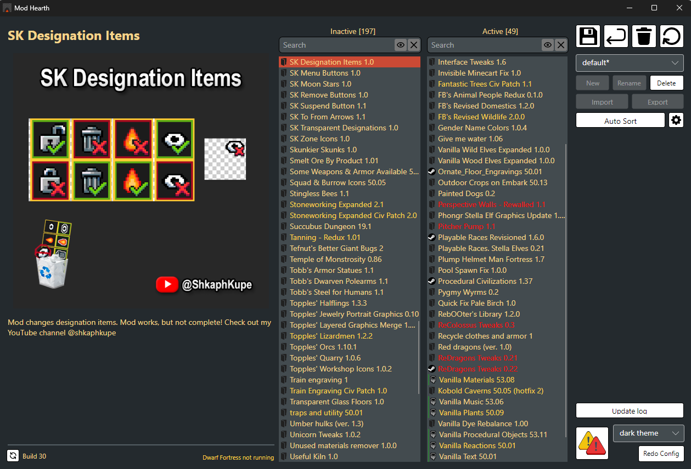

# ModHearth Mod Manager for Dwarf Fortress
This is a modified mod manager for the steam version of Dwarf Fortress, made to interact with both DFHack and steam workshop mods. Yes this was vibe coded with the assistance of codex and claude, because I have 0 idea how c# and lua work. Yes you have absolutely the right to kill me and spit on my grave for this.

## User Information:

### Requirements:
- Dwarf Fortress steam version
- Windows or Linux
- DFHack installed ([Steam](https://store.steampowered.com/app/2346660/DFHack__Dwarf_Fortress_Modding_Engine/)) ([Github](https://github.com/DFHack/dfhack/releases)). This is because (being one of many reasons) Dwarf fortress **does not natively support** modlist files or folders, and memory injection is required for such
- [.NET 8 runtime](https://dotnet.microsoft.com/en-us/download/dotnet/8.0) installed

### Installation Guide
1. Go to [releases](https://github.com/EggleEgg/ModHearth/releases/) and download the most recent version for your OS
2. Extract the archive to a suitable location
3. Run ModHearth (ModHearth.exe on Windows)
4. Locate the Dwarf Fortress executable (df.exe on Windows, df on Linux, inside the app bundle on macOS) if ModHearth fails to fetch it

### Instructions
Information on the four buttons from left to right:
- Save button: saves the current modlist to file. With DFHack installed, it also reloads the game's mod screen.
- Undo button: undoes changes made to the current modlist. Can only undo mod order/enable/disable changes, not renaming or deletion.
- Trash can: clears installed mods cache. Right click to open the installed mods folder.
- Reload button: restarts ModHearth. Right click for autoreload settings.

### Keyboard Shortcuts and Controls
- Shift + click top to bottom to select multiple mods.
- Ctrl + click toggles individual mods in a multi-selection.
- Ctrl+Z triggers undo.
- Ctrl+Y re‑applies the last undone change.
- Escape to deselect mods.
- Delete selects the previously selected mod.
- Backspace removes the selected mods.

## Contributor Information

### General Functionality
This tool works by pulling mods from the dwarf fortress mods folder, and pulling modpacks from either the DFHack config (mod-manager.json) or ModHearth's local fallback (modpacks.local.json).
ModReferences are generated from found mod folders, while modpacks are generated from the active modpack file.
With DFHack installed, loading modpacks into the game is done via altering mod-manager.json and using DFHack's normal mod management once the game loads.

### Term Definitions
#### DFHMod
DFHack only deals with mod name and mod version. This is all that's saved and loaded.
These are set up to act like a value type.  

#### ModReference
A more comprehensive object storing more information about mods, mostly for displaying. Is not saved.
Can easily be converted to a DFHMod.

#### DFHModPack
An object representing a modpack matching how DFHack handles them. Only has a name, a bool default, and a list of DFHMods.
DFHack stores a list of these in a json file, which it loads into the game. ModHearth's local fallback file uses the same format. 
